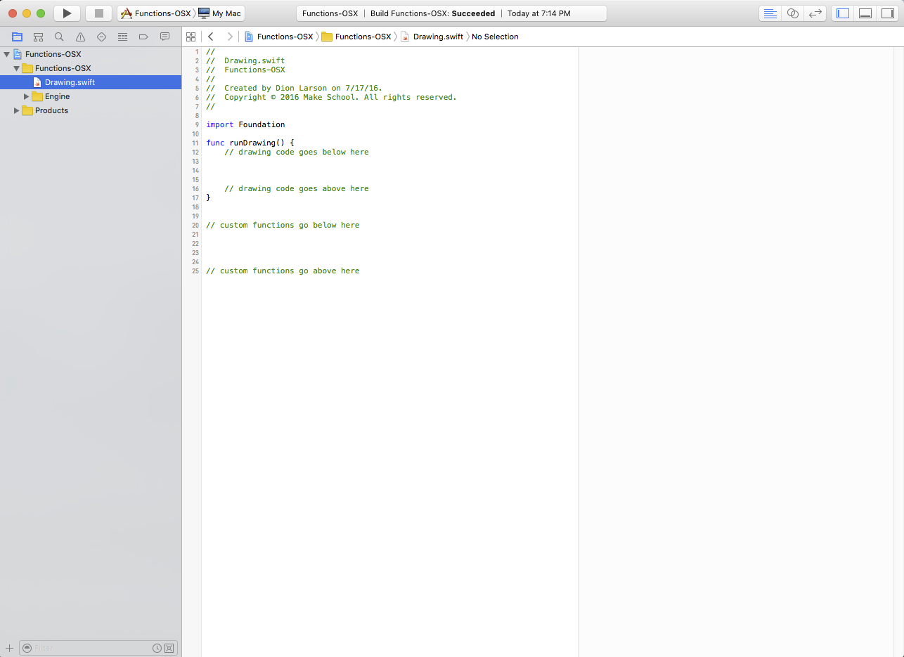
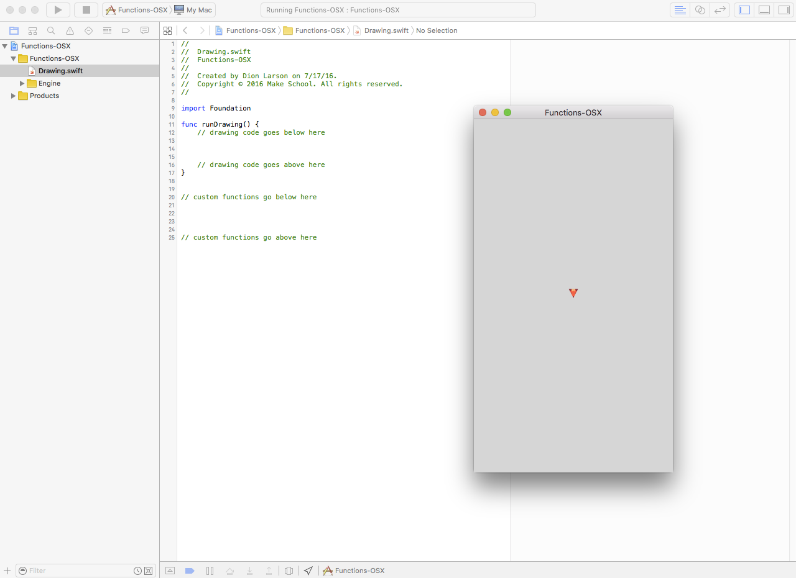

> [info]
> Xcode 8 and Swift 3 was released on on September 13th, 2016. Please make sure to update as soon as possible. [The first lesson](https://www.makeschool.com/academy/tutorial/getting-started-with-xcode-playgrounds-0afee09b-0bdb-47bd-8551-e179266b6b65/get-started-with-xcode-74d7476e-22f1-403c-99ab-b767f1a7b71e) has been updated with instructions for checking your version and updating if necessary.

<!--  -->

> [info]
> Only do this tutorial if the previous Functions Playground did not work on your computer!

**This is an archive of the Xcode 7 instructions. Go back to the dashboard to find the Xcode 8 version.**

Now that we've learned _variables_, let's move on to _functions_. In this _Swift Playground_, you will learn how to group code into reusable blocks called _functions_. This will allow you to organize your code to be highly reusable. You'll learn how to call to call functions, pass data into them and return data from them. Throughout this playground you will create some pretty cool art! Get ready to be creative :)

> [action]
>
1. Download the Functions Xcode project from [here](https://github.com/MakeSchool-Tutorials/Functions-OSX-Starter/archive/master.zip).
1. Double-click the downloaded zip file to "extract it".
1. Inside the newly extracted folder you should see a file named `Functions-OSX.xcodeproj`, drag this into your "Make School Projects" folder.
1. Open your "Make School Projects" folder and double-click `Functions-OSX.xcodeproj` to get started!

# Exploring Xcode

Your screen should look something like this:



Let's dissect the different user interface elements we're seeing here:

- On the left hand side, there is your __Navigator__: This lists all the files that are in the project hierarchy. You can _single-click_ on any one of the files there, to change the center pane to display the file you want to look at. Note that _double-clicking_ will open up a new window containing the file instead, so make sure you always single-click to navigate to files. Try navigating to the file `Drawing.swift` now.
  - There are multiple tabs available within the Navigator section, which you can reveal by clicking on the icons on the top, or by using the keyboard shortcuts ⌘1, ⌘2, etc. Particularly useful tabs include the __Find__ tab (⌘3) – which lets you do a full text search on your entire project – and the __Issues__ tab (⌘4), which lets you know of any compile-time or run-time errors and warnings you may have.
  - At the bottom left corner of the navigator, there's a "+" sign. If you click it, you can create new files in your project hierarchy (You can also use the handy shortcut ⌘N). Note that the file will be placed under the current group that your navigator has selected: therefore, make sure you click a group you want your new file to be under, before you add.
- On the right hand side is your __Utilities__ sidebar: This will show you quick information about the file you have opened currently; in the case of a `.swift` file, it will tell you information like the file path that it resides in, its group path, and various text settings like the text encoding and tab setting.
- The center pane you've been staring at is the __Editor__ – where you edit your code! Besides obviously being able to make changes to your code, you can navigate to different files via the breadcrumb menu at the top of the pane.
- There is a __Debug Area__ pane at the bottom side of your window; this would display your `print()` statements if you decided to run any from your code. If you don't see it, click the middle button in the 3-button group at the top right corner of your window, or press the shortcut ⇧⌘Y. The debug area is very useful for testing your program output!
- Lastly, at the top left corner of the window – right next to the window close/minimize/maximize buttons – are your __Play__, __Stop__, and __Device Selection__ buttons! Hitting Play will compile and run your code, and hitting Stop will stop execution of your code.

> [info]
> Don't worry about memorizing all of this. You can always come back to reference it whenever you want. The more you use Xcode, the more this will all become second nature!

# Running the starter code

Now that we have a grasp of the Xcode interface, let's try running the starter code to see what we're looking at!

> [action]
> Run the starter code, to do so, press the Play button!
>
> A new application entitled "Functions-OSX" should open up, it should load up the app, displaying a an empty canvas!
> 

Great! We're ready to get started!

# Becoming Functional

Now that you have some control over variables, it's time to move on to _functions_. _Functions_ are chunks of code that you can reuse by _calling the function_. You will be working with a special drawing tool throughout most of this Playground. The pictures will start off simple and build up in complexity as you learn more and experiment.

## Let's call a function!

We're going to jump right into things so you can call your first function.

> [action]
> Enter the following line of code below `// drawing code goes below here` but above `// drawing code goes above here`.
>
```
moveFifty()
```
> Run the project (play button at the top left), and watch the visualization to see what happens!

<!--  -->

> [info]
> Lines that start with `//` are called comments. They allow you to type messages and hints to yourself or other developers reading your code. `//` tells the computer to ignore anything on the same line after it.

# What did that do?

What can we infer about _function calls_ from the line we just entered?

## Anatomy of a function call

A _function call_ looks a lot like a variable but it has parentheses after it. Function calls take the form of:

```
functionName()
```

In this case, you called a function named `moveFifty`. What happened in the visualization? You should have seen the triangle move `50 units` and leave behind a line.

It's important to keep in mind that functions (like variables) must be defined before they are called. We have already defined the `rotateNinety()` function for you in another file. `rotateNinety()` will work anywhere but you cannot just call `moveThirty()` and expect it to work. A `moveThirty` has not been defined yet. We'll show you how to define your own functions soon but let's focus on calling them for now.

> [challenge]
> What happens if you call the `moveFifty` function again after the last line you entered? What happens if you call it a third time? Run the project to test it out!

<!--  -->

> [info]
> Make sure each function call is on a separate line and don't forget the parentheses!
